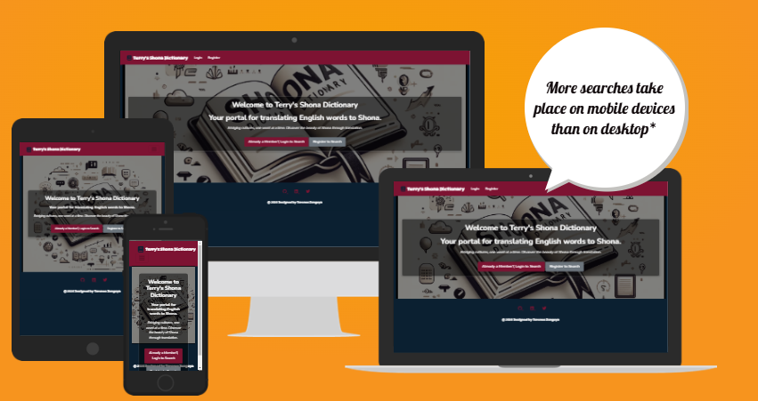

# Terry's Shona Dictionary App

[Terry's Shona Dictionary - live link](https://my-shona-dictionary-app-ce78fcb5d522.herokuapp.com/)

Welcome to Terry's Shona Dictionary, a web application designed for users who want to learn and explore the Shona language. This app allows users to search for English words and discover their meanings in Shona, providing an engaging and accessible way to dive into the language. By offering a clean user interface, login functionality, and search capability, Terry's Shona Dictionary aims to support language learning for Shona-speaking and non-speaking audiences alike.

 

## Index 
* [Key Features](#key-features) 
* [Technology Stack](#technology-stack)
* [User Stories](#user-stories)
* [Contributing](#contributing)
* [Acknowledgement](#acknowledgement)

## Key Features

- __Word Translation:__ Users can search for English words to find their Shona translations. The dictionary contains over 300 common words with plans for expansion.

- __User Authentication:__ Users can register, log in, and log out to access the dictionary, track their learning, and receive personalized recommendations.

- __Print Option:__ Users can print translation results for offline reference.
Responsive Design: The app is optimized for mobile, tablet, and desktop, ensuring a seamless experience across devices.

- __Social Media Integration:__ Links to GitHub, LinkedIn, and other social media channels to keep users updated on app developments and engage with the developer community.

**[⬆ Back to Index](#index)**

## Technology Stack

__Frontend:__ HTML, CSS (Bootstrap), JavaScript (jQuery, Vanilla JavaScript)

__Backend:__ Django framework with Django templates

__Database:__ SQLite (for development) and scalable to PostgreSQL (for production)

__Authentication:__ Django Allauth for secure user management

__Hosting:__ Compatible with any Django-supporting server (e.g., Heroku, DigitalOcean)

**[⬆ Back to Index](#index)**

### User Stories

Here are ten user stories, each with one acceptance criterion, to guide potential collaborators on what the app needs to fulfill user expectations. These stories can be added to the Kanban board to facilitate Agile methodology.

1.  __User Registration__

    - As a __new user,__ I want __to register an account__ so that __I can save my preferences and view my search history.__

    - __Acceptance Criteria:__ Given a new user, when they complete the registration form, they should be able to log in immediately with their new credentials.

 

2. __User Login__

   - As a __returning user,__ I want __to log in to my account__ so that __I can continue where I left off.__

   - __Acceptance Criteria:__ Given a registered user, when they enter their correct credentials, they should gain access to their account.

   

3. __English to Shona Word Search__

   - As a __user,__ I want __to enter an English word and get its Shona translation__ to __expand my vocabulary.__

   - __Acceptance Criteria:__ Given a word that exists in the dictionary, when a user searches for it, they should see the correct Shona translation.

 

4. __Error Handling for Unknown Words__

   - As a __user,__ I want __to be notified__ if my __searched word is not found in the dictionary.__

   - __Acceptance Criteria:__ Given a word that does not exist in the dictionary, when a user searches for it, they should see an error message.

 

5. __Print Translations__

   - As a __user,__ I want __the option to print a translation__ so that __I can keep a physical copy for reference.__

   - __Acceptance Criteria:__ Given a search result, when a user clicks the "Print" button, a print dialog should open with the translation displayed.

 

6. __Logout__

   - As a __logged-in user,__ I want __to securely log out__ so that __my account information is safe and secure.__

   - __Acceptance Criteria:__ Given a logged-in user, when they click "Logout," they should be redirected to the homepage and their session ended.

 

7. __Responsive Mobile Experience__

   - As a __user on a mobile device,__ I want __the app layout to adapt to my screen__ so that __I can use the app comfortably.__

   - __Acceptance Criteria:__ When a user accesses the app on a mobile device, the layout should adjust to fit the screen without overlapping elements.

 

8. __Display User’s Search History__

   - As a __registered user,__ I want __to view my previous search history__ to __track my learning progress.__

   - __Acceptance Criteria:__ Given a logged-in user, when they view their profile, they should see a list of previously searched words.

 

9. __Favorites Feature__

    - As a __user,__ I want __to mark words as favorites__ so that __I can easily refer to them later.__

    - Acceptance Criteria: Given a word, when a user clicks the "Favorite" button, it should be saved to their favorites list.

 

10. __Admin Panel for Word Management__

    - As __an admin,__ I want __to add, edit, or delete words in the dictionary__ to __keep the content accurate and relevant.__

    - __Acceptance Criteria:__ Given an admin user, when they access the admin panel, they should be able to manage dictionary entries.

**[⬆ Back to Index](#index)**

## Contributing

Contributions are welcome! If you'd like to add new features, fix bugs, or improve the code, please feel free to fork the repository and submit a pull request. Be sure to adhere to the following guidelines:

__Code Quality:__ Follow PEP 8 and Django best practices.

__Testing:__ Ensure all tests pass before submitting a pull request.

__Documentation:__ Update documentation as needed to reflect any new changes.

**[⬆ Back to Index](#index)**

 

## Acknowledgement 

- Project idea by __Terence Zengeya__, influenced by the native Shona language as a Zimbabwean Developer.

**[⬆ Back to Index](#index)**

 